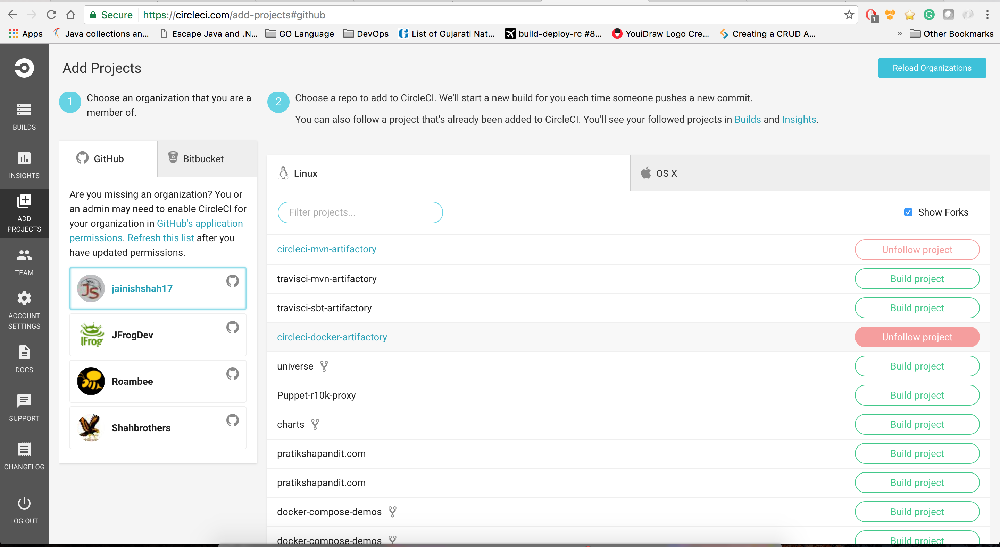
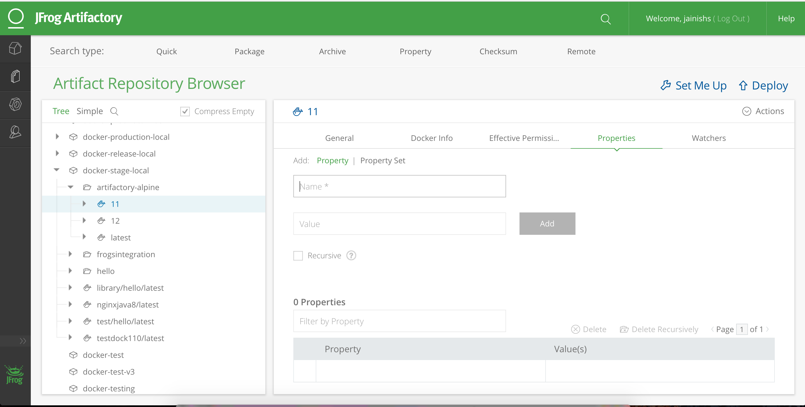

# Artifactory Integration with Circle CI
## Store build information and build artifacts to JFrog Artifactory
## Build Status 

`To make this integration work you will need to have running Artifactory-pro/Artifactory SAAS.`

### Steps to build docker images using Circle CI and push it to Artifactory.

##### Step 1:

copy `circle.yml` to your project

##### Step 2:

Enable your project in CircleCI.

##### Step 3:

add Environment Variables `ARTIFACTORY_USER`, `ARTIFACTORY_EMAIL`, `ARTIFACTORY_DOCKER_REPOSITORY` and `ARTIFACTORY_PASSWORD` in build settings of CircleCI.
In this example `$ARTIFACTORY_DOCKER_REPOSITORY=gcartifactory-us.jfrog.info:5005`

##### Step 4:

You should be able to see published Docker image and build information in Artifactory.

## Note: `This solution only supports Artifactory with valid ssl as Circle CI does not support insecure docker registry `

  

For more information about the benefits of JFrog Artifactory as a secure and private [Docker registry](https://jfrog.com/integration/docker-registry/) visit [Artifactory's documentation page](https://www.jfrog.com/confluence/display/RTF/Docker+Registry).
