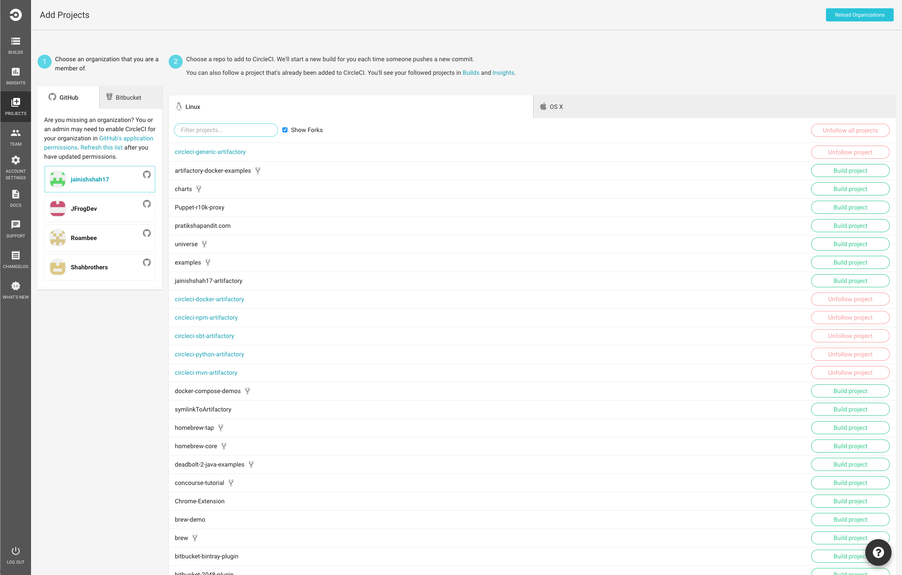
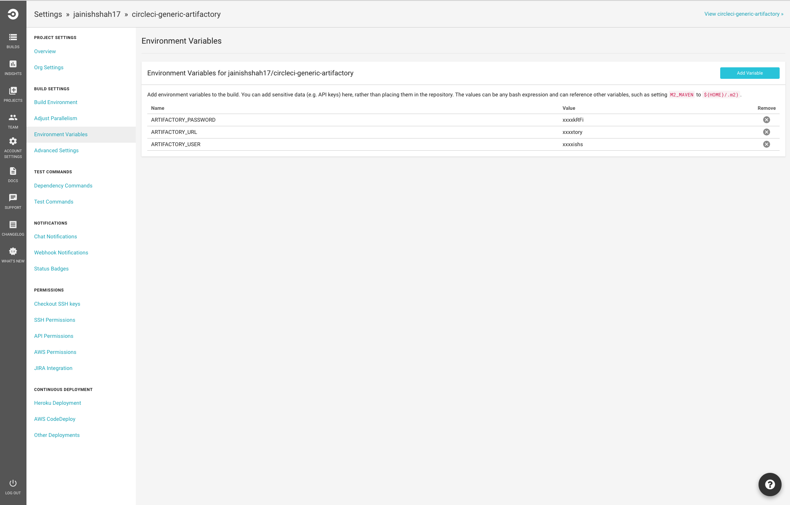
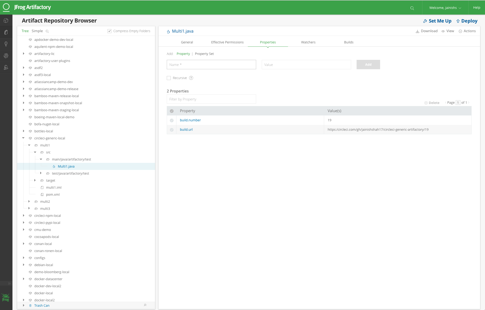
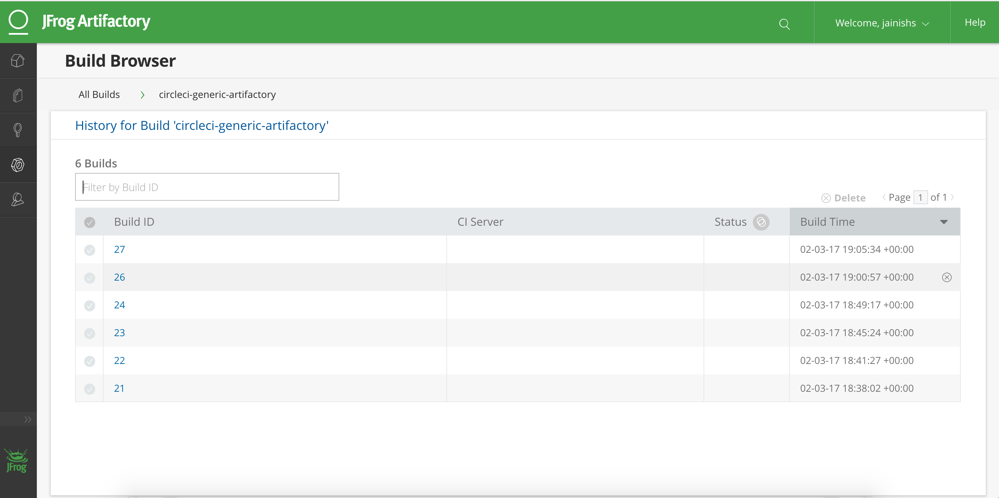

# Artifactory Integration with Circle CI using Artifactory CLI
### Store build information and build artifacts to JFrog Artifactory
## Build Status

`To make this integration work you will need to have running Artifactory-pro/Artifactory SAAS.`

## Steps to Integrate Circle CI with Artifactory.

Step 1:

copy `circle.yml` file to your project.

Step 2:

Enable your project in CircleCI.

Step 3:

add Environment Variables ARTIFACTORY_URL, ARTIFACTORY_USERNAME and ARTIFACTORY_PASSWORD in build settings of CircleCI.

Step 5:

You should be able to see published artifacts in artifactory.

Step 6: 

Check build info in build section of Artifactory.

