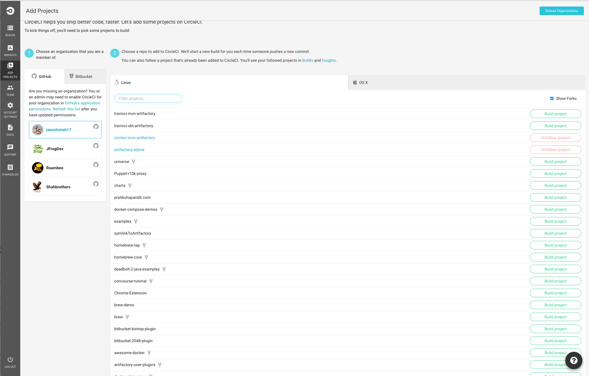
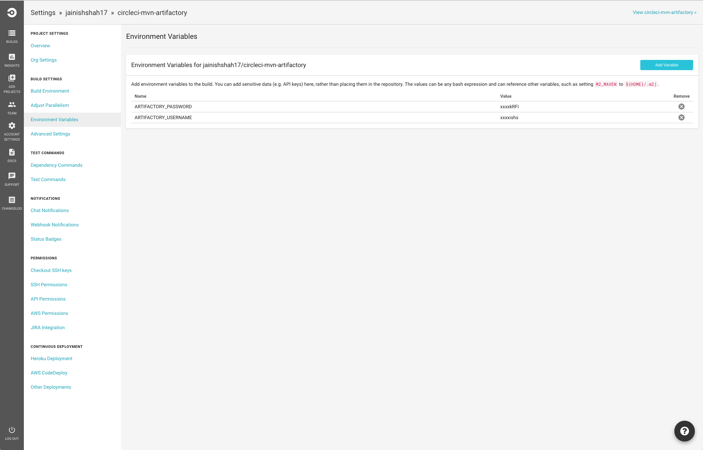
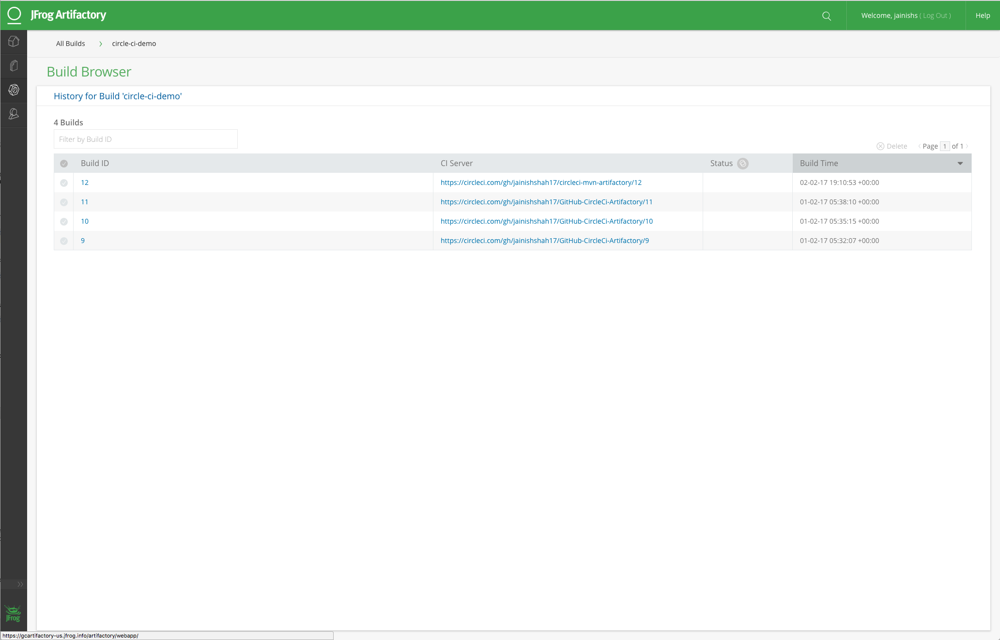

# Artifactory Integration with Circle CI using Maven Artifactory Plugin

## Store build information and build artifacts to JFrog Artifactory

## Build Status
[](https://circleci.com/gh/jainishshah17/circleci-mvn-artifactory)

`To make this integration work you will need to have running Artifactory-pro/Artifactory SAAS.`

## Steps to Integrate Circle CI with Artifactory.

Step 1:

copy `circle.yml` file to your project.

Step 2:

Configure artifactory-maven-plugin to your project by copying following to your pom.xml:
```
            <plugins>
                        <plugin>
                            <groupId>org.jfrog.buildinfo</groupId>
                            <artifactId>artifactory-maven-plugin</artifactId>
                            <version>2.4.1</version>
                            <inherited>false</inherited>
                            <executions>
                                <execution>
                                    <id>build-info</id>
                                    <goals>
                                        <goal>publish</goal>
                                    </goals>
                                    <configuration>
                                        <deployProperties>
                                            <gradle>awesome</gradle>
                                        </deployProperties>
                                        <artifactory>
                                            <includeEnvVars>true</includeEnvVars>
                                            <timeoutSec>60</timeoutSec>
                                            <propertiesFile>publish.properties</propertiesFile>
                                        </artifactory>
                                        <publisher>
                                            <contextUrl>https://gcartifactory-us.jfrog.info/artifactory</contextUrl>
                                            <username>${username}</username>
                                            <password>${password}</password>
                                            <excludePatterns>*-tests.jar</excludePatterns>
                                            <repoKey>libs-release-local</repoKey>
                                            <snapshotRepoKey>libs-snapshot-local</snapshotRepoKey>
                                        </publisher>
                                        <buildInfo>
                                            <buildName>circle-ci-demo</buildName>
                                            <buildNumber>${buildNumber}</buildNumber>
                                            <buildUrl>${buildUrl}</buildUrl>
                                        </buildInfo>
                                        <licenses>
                                            <autoDiscover>true</autoDiscover>
                                            <includePublishedArtifacts>false</includePublishedArtifacts>
                                            <runChecks>true</runChecks>
                                            <scopes>compile,runtime</scopes>
                                            <violationRecipients>build@organisation.com</violationRecipients>
                                        </licenses>
                                    </configuration>
                                </execution>
                            </executions>
                        </plugin>
            </plugins>   
```

Edit the pom.xml file and set the value of the *contextUrl* with your Artifactory URL, as well as the other Artifactory properties.
For more configuration information see the [Maven Artifactory Plugin documentation](https://www.jfrog.com/confluence/display/RTF/Maven+Artifactory+Plugin).
          
               
Step 3:

Enable your project in CircleCI.



Step 4:

add Environment Variables ARTIFACTORY_USERNAME and ARTIFACTORY_PASSWORD in build settings of CircleCI.



Step 5:

You should be able to see published artifacts and build info in artifactory.



---
## Plugin documentation

The full plugin documentation is available [here](https://www.jfrog.com/confluence/display/RTF/Maven+Artifactory+Plugin).

Learn about Artifactory as a [maven repository](https://jfrog.com/integration/maven-repository/) and [how to resolve artifacts through Artifactory](https://www.jfrog.com/confluence/display/RTF/Maven+Repository#MavenRepository-ResolvingArtifactsthroughArtifactory).