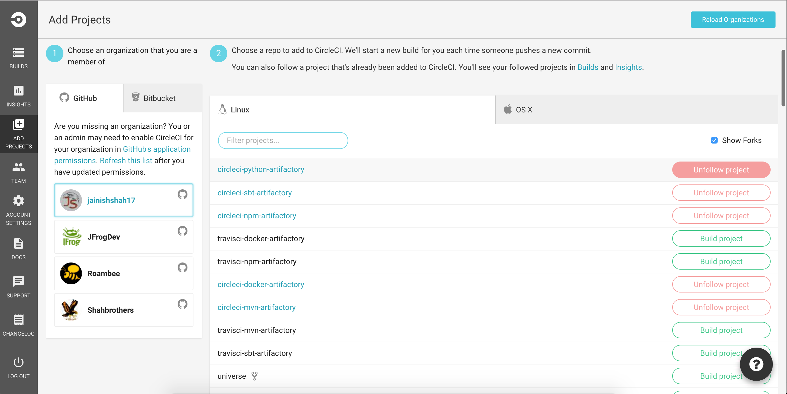
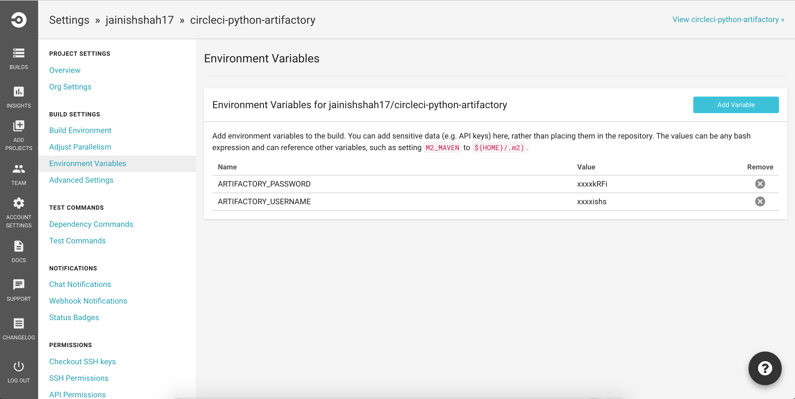
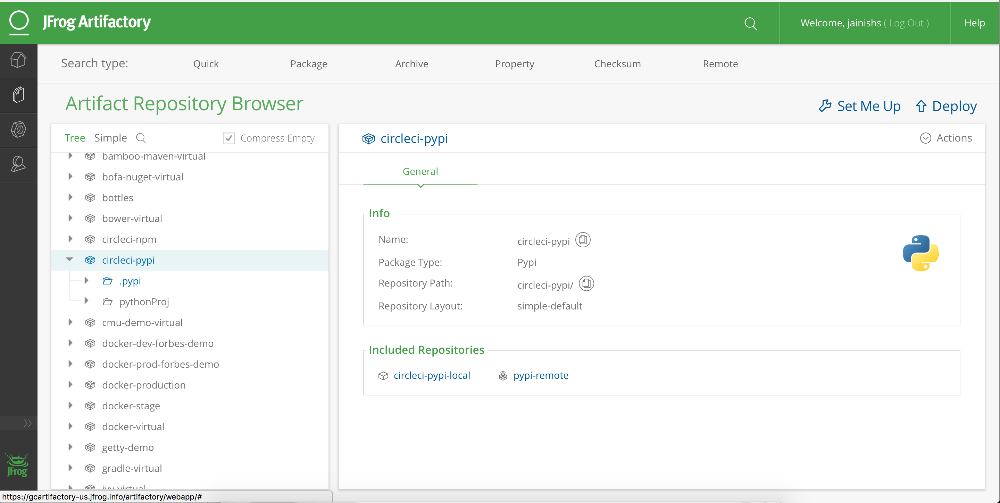

# circleci-python-artifactory

## Store build information and build artifacts to JFrog Artifactory

### Build Status
[](https://circleci.com/gh/jainishshah17/circleci-python-artifactory)

## Artifactory Integration with Circle-CI

`To make this integration  work you will need to have running Artifactory-pro/Artifactory SAAS.`

#### Python Example
This is a sample project that resolve a dependency from Artifactory and deploys the build artifacts to Artifactory.

Step 1:

copy ```circleci.credential.sh``` and ```circle.yml``` file to your project.

`Note: Change your repository in .circleci.credential.sh accrodingly` 

Step 2: 

Enable your project in CircleCI .



Step 3:

add Environment Variables ARTIFACTORY_USERNAME and ARTIFACTORY_PASSWORD in build settings of CircleCI.



Step 4:

Trigger build.

Step 5: 

You should be able to see published artifacts in artifactory.


