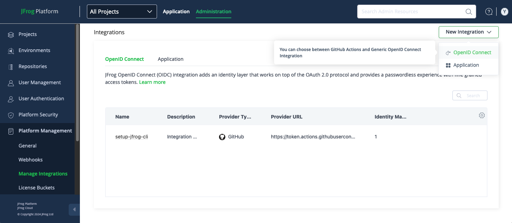
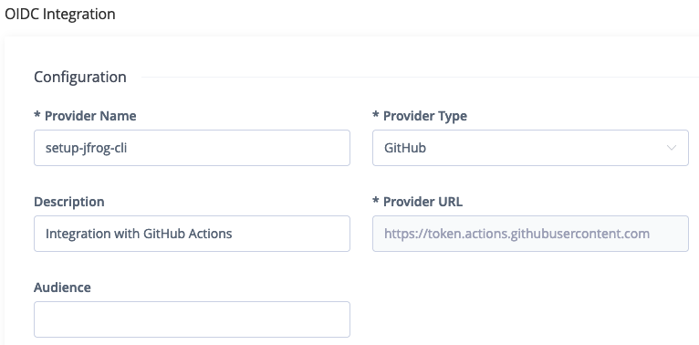
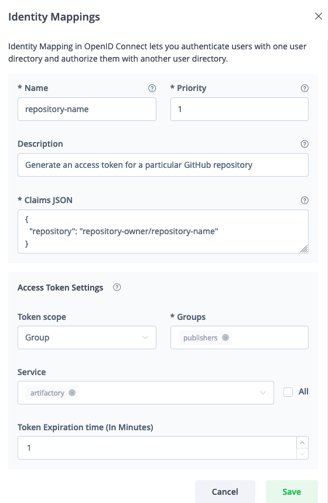

# OIDC Github Action Example

This is an example of a basic GitHub workflow that uses the [Setup JFrog CLI GitHub Action](https://github.com/jfrog/setup-jfrog-cli) with an [OIDC integration](https://openid.net/developers/how-connect-works) between the JFrog Platform and GitHub Actions.

## Creating the OIDC Integration

This phase sets an OIDC integration between GitHub Actions to the JFrog platform.

1. Navigate to the Administration tab In the JFrog Platform UI
2. Click `Platform Management` | `Manage Integrations`
3. Click `New Integration` | `OpenID Connect`:
   
4. Configure the OIDC integration:
   
5. Configure the Identity Mapping:

   

## Running the Example

1. Create a new Github repository.
2. In the Github repository you created, create a [secret](https://help.github.com/en/articles/virtual-environments-for-github-actions#creating-and-using-secrets-encrypted-variables) named _JF_URL_. Set the value of the secret to be the JFrog Platform URL, such as https://acme.jfrog.io.
3. Push the [workflow.yml](.github/workflows/workflow.yml) file as part of this example, under `.github/workflows/` in your Github repository.
4. Watch the workflow running following any push to the repository.

## Resources

- [OpenID Connect Integration](https://jfrog.com/help/r/jfrog-platform-administration-documentation/openid-connect-integration)
- [Secure Access To Your Software Development with GitHub OpenID Connect (OIDC) and JFrog](https://jfrog.com/blog/secure-access-development-jfrog-github-oidc)
