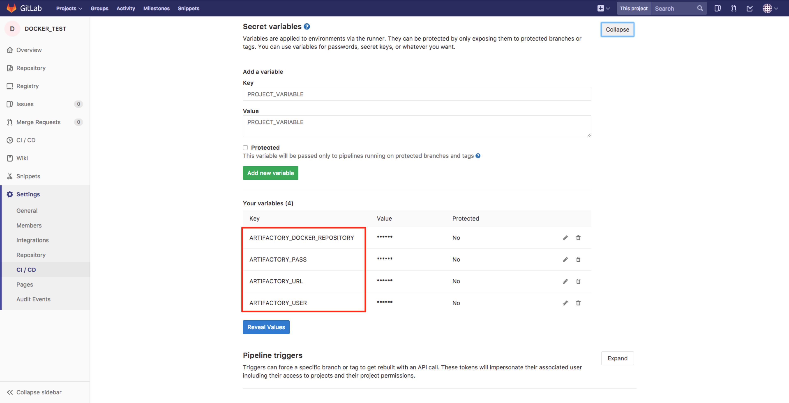
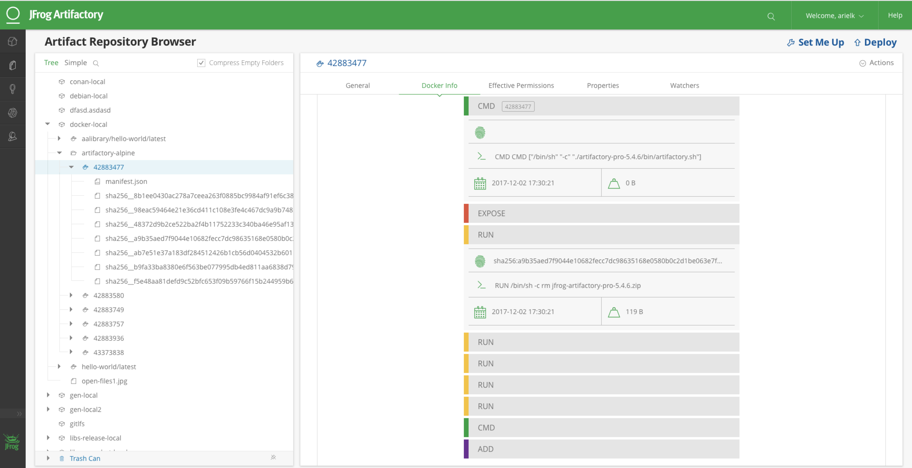

# Integrating JFrog Artifactory with GitLab CI using JFrog CLI
## Store build information and build artifacts to Artifactory
### Docker example of using GitLab CI with Artifactory.
This sample project resolves dependencies from Artifactory and deploys the build artifacts to Artifactory.

#### Prerequisite
Artifactory Pro / Artifactory SAAS

#### Step 1:
In the Docker project, configure the following Artifactory credentials, under CI/CD Settings > Secret variables: ARTIFACTORY_URL, ARTIFACTORY_USER, ARTIFACTORY_PASS, ARTIFACTORY_DOCKER_REPOSITORY and DOCKER_REPOSITORY_KEY.

#### Step 2:
Place a .gitlab-ci.yml file in the root of your project, as used in this sample project.

#### Step 3:
You can view the published artifacts and build information in Artifactory.

