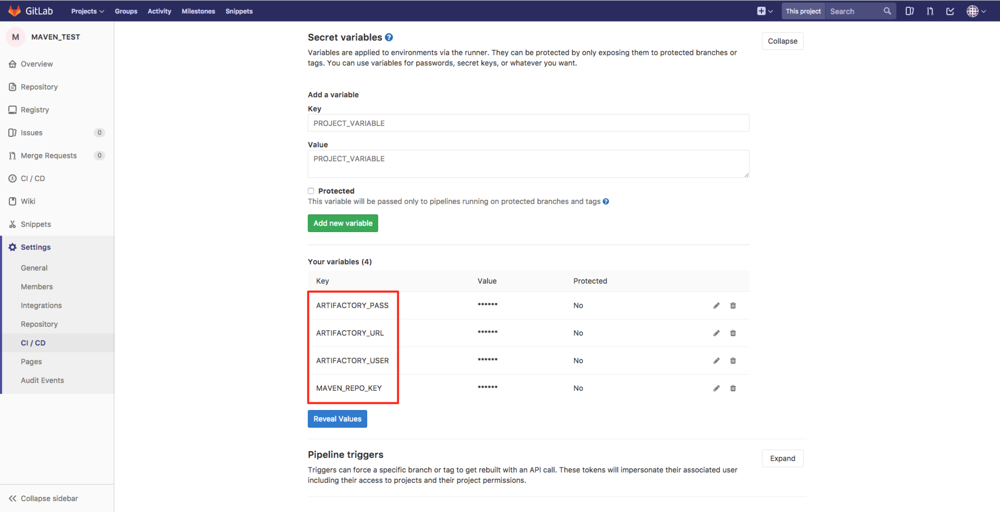
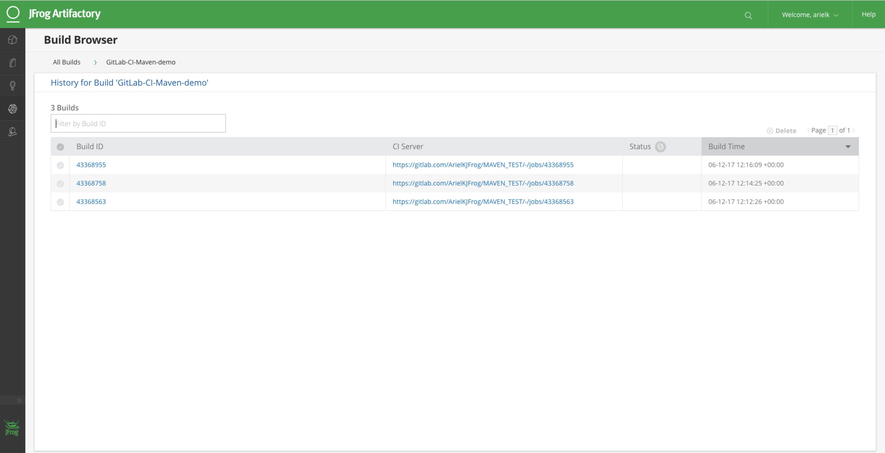

# Integrating JFrog Artifactory with GitLab CI using JFrog CLI
## Store artifacts and build information to Artifactory
### Follow this step-by-step workflow to Integrate GitLab CI with Artifactory.
This sample project resolves dependencies from Artifactory and deploys the build artifacts to Artifactory.
#### Prerequisite
Artifactory Pro / Artifactory SAAS  

#### Step 1:
In the Maven project, configure the following Artifactory credentials, under CI/CD Settings > Secret variables: ARTIFACTORY_URL, ARTIFACTORY_USER, ARTIFACTORY_PASS, and MAVEN_REPO_KEY.

#### Step 2:
Place a .gitlab-ci.yml file in the root of your project, as used in this sample project.

#### Step 3:
View the published artifacts and build information in Artifactory.

