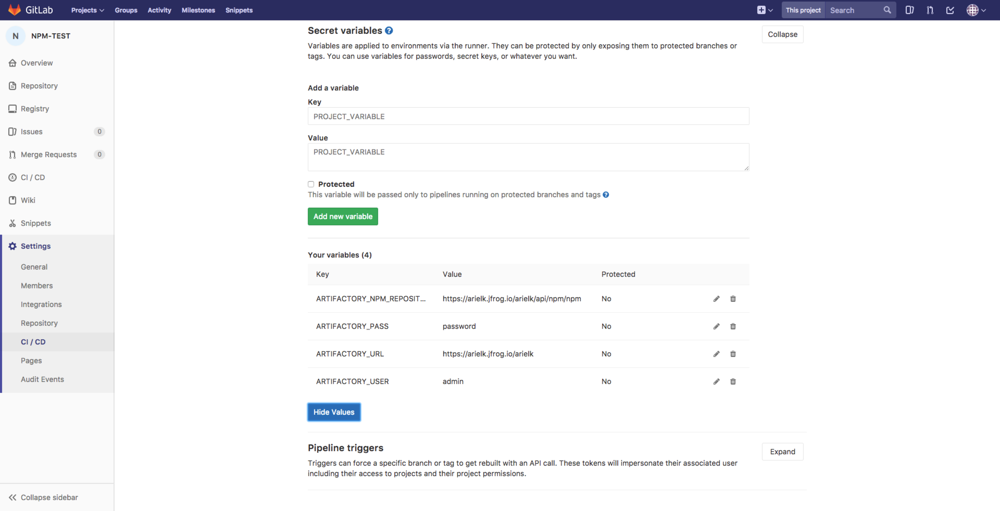
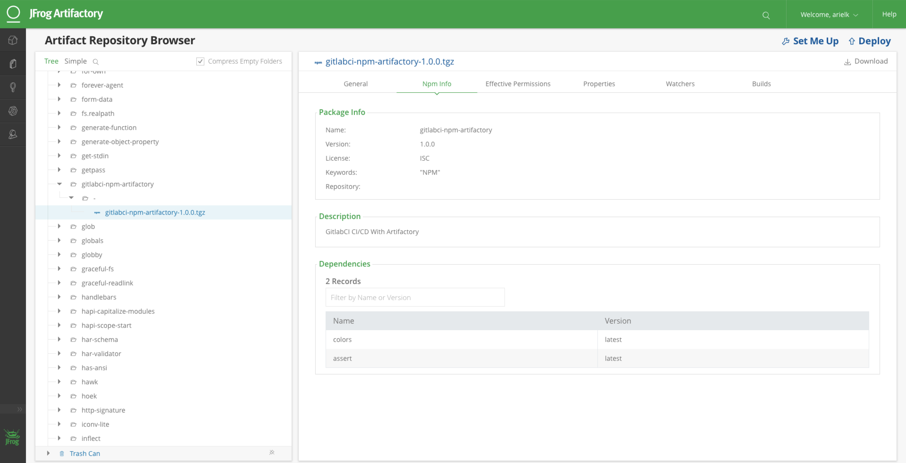

# Integrating JFrog Artifactory with GitLab CI using JFrog CLI
## Store build information and build artifacts to Artifactory
### NPM example of using GitLab CI with Artifactory.
This sample project resolves dependencies from Artifactory and deploys the build artifacts to Artifactory.

#### Prerequisite
Artifactory Pro / Artifactory SAAS version 5.5.2 and above.  

#### Step 1:
In the NPM project, configure the following Artifactory credentials, under CI/CD Settings > Secret variables: ARTIFACTORY_URL, ARTIFACTORY_USER, ARTIFACTORY_PASS, and ARTIFACTORY_NPM_REPOSITORY.

#### Step 2:
Place a .gitlab-ci.yml file in the root of your project, as used in this sample project.

#### Step 3:
You can view the published artifacts and build information in Artifactory.

Find out more about using the [NPM command line](https://www.jfrog.com/confluence/display/RTF/Npm+Registry#NpmRegistry-UsingtheNpmCommandLine) and also about [Artifactory as an NPM registry](https://jfrog.com/integration/npm-registry/).
Also read about [JFrog CLI's integration with NPM](https://www.jfrog.com/confluence/display/CLI/CLI+for+JFrog+Artifactory#CLIforJFrogArtifactory-BuildingNpmPackages).