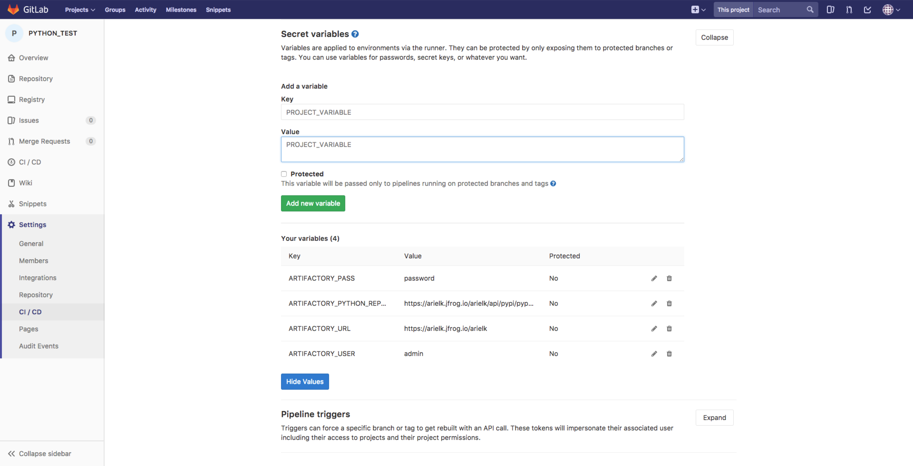
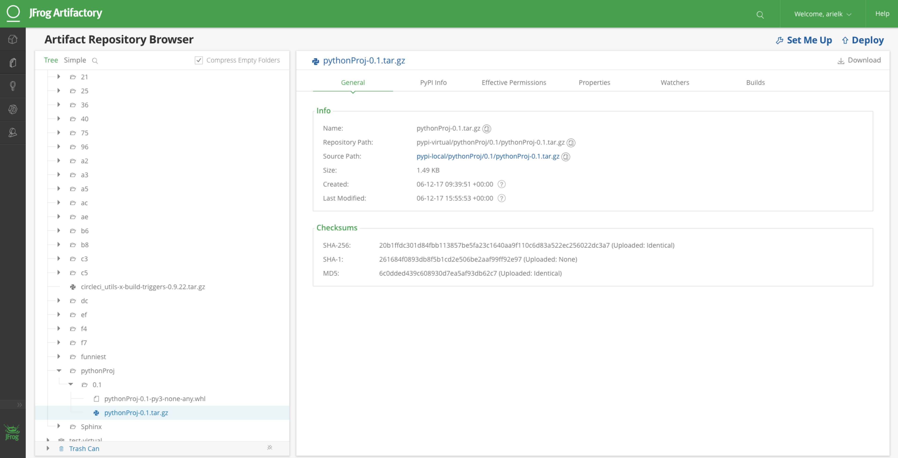

# Artifactory Integration with GitLab CI

## Store build information and build artifacts to JFrog Artifactory

### Python example of using GitLab CI and with Artifactory.

`To make this integration  work you will need to have running Artifactory-pro/Artifactory SAAS.`

`This is a sample project that resolve a dependency from Artifactory and deploys the build artifacts to Artifactory.`

#### Step 1:

Configure the following Secret Variables in CI/CD Settings of your Python project: ARTIFACTORY_URL, ARTIFACTORY_USER, ARTIFACTORY_PASS, ARTIFACTORY_PYTHON_REPOSITORY.

#### Step 2:

Place a .gitlab-ci.yml & gitlabci-credential.sh in the root of your project, following this example.

#### Step 3:

You should be able to see published artifacts in artifactory.

