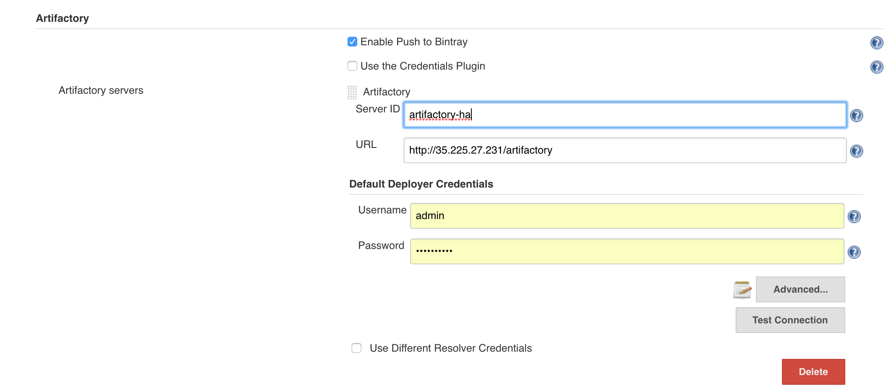

## Create an application war file

• Creates a sample application called ‘webservice-1.1.2.war’
• Pushes it to a local repository in Artifactory

### Step to create Jenkins Pipeline:
<b>Note:</b> List of required Jenkins plugins
*   [Artifactory Plugin](https://wiki.jenkins.io/display/JENKINS/Artifactory+Plugin)   
*   [Docker Pipeline Plugin](https://wiki.jenkins.io/display/JENKINS/Docker+Pipeline+Plugin)   
*   [GitHub plugin](https://plugins.jenkins.io/git)   
*   [Pipeline Github Plugin](https://wiki.jenkins.io/display/JENKINS/Pipeline+Github+Plugin)   
*   [Pipeline Plugin](https://wiki.jenkins.io/display/JENKINS/Pipeline+Plugin)   
*   [Gradle Plugin](https://wiki.jenkins.io/display/JENKINS/Gradle+Plugin)   

1.  Configure Artifactory server in Jenkins Manage Jenkins -> Configure System -> Artifactory -> Add Artifactory Server.  
    

2.  Create Gradle repositories in Artifactory using [quick setup wizard](https://www.jfrog.com/confluence/display/RTF/Getting+Started#GettingStarted-OnboardingWizard).       

3.  Create new Jenkins Pipeline Job.

4.  Add String Parameters:
    *   GRADLE_TOOL (String Parameter) : Provide name of configured Gradle installation 
		e.g `GRADLE_TOOL : gradle-3.5.1`
    *   DEPLOY_REPO (String Parameter) -> Artifactory Gradle Repository name 
		e.g.  `DEPLOY_REPO -> gradle-release`
    *   SERVER_ID (String Parameter) : Artifactory Server Id 
	    e.g. `SERVER_ID -> artifactory`
    *   XRAY_SCAN (Choice Parameter) : Xray Scan. Applicable only if you are using JFrog Xray 
    	e.g. `XRAY_SCAN -> NO`
    *   CLEAN_REPO (Choice Parameter) : Clean gradle cache before building project 
    	e.g. `CLEAN_REPO -> YES`
    	
5.  Copy [Jenkinsfile](Jenkinsfile) to Pipeline Script.

6.  To build it, press Build Now.

7.  Check your newly published build in build browser of Artifactory.
