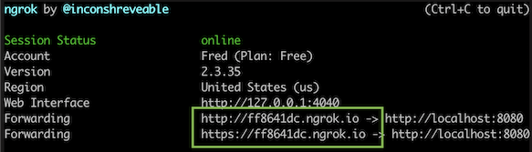
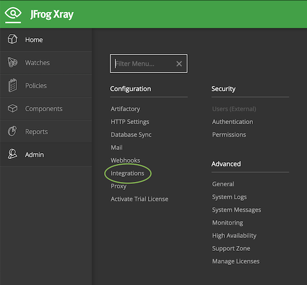
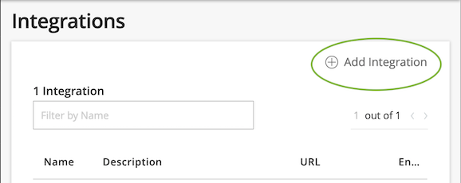
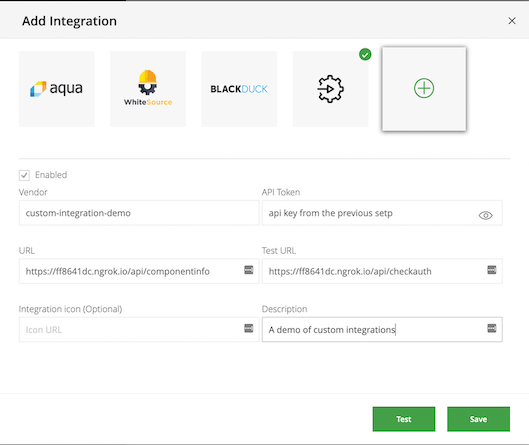
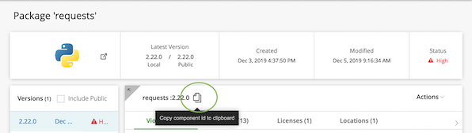
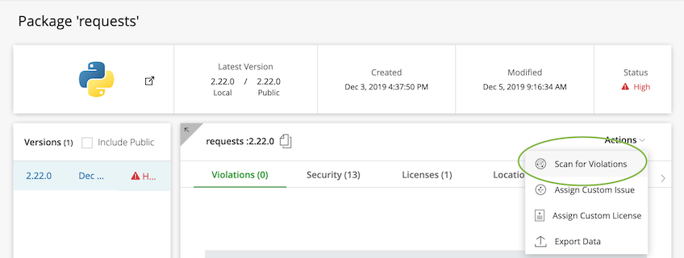

XRay Custom Integration Demo
=====

This guide is for users already familiar with the features of XRay and Artifactory. For a more detailed version of the same guide, see [DETAILED.md](./DETAILED.md).

## What is a Custom Integration?

By default Xray looks for vulnerabilities and licenses in its vulnerabilities database.

In the case that you would like to enrich this data based on your internal sources you can use the Custom Integration option.

It allows you to add your own vulnerabilities and licenses to a component that is being scanned by Xray.


#### **How does it work?**

Each time Xray scans a component, it will also call the integration to check if the integration has any additional vulnerability or license information about the component.

If the integration provides such data, Xray will add these additional vulnerabilities and licenses to the data of the component in Xray, and will apply the Security and License policies based on these additions.


This project contains an example of such a custom integration that you can use to learn what is expected from such an integration.

### Creating a custom Integration

There are two pieces to set up:

- Your custom integration server
- XRay

### Files in this project

**[main.go](./main.go)**

This file contains the application code. It's an http server using golang's built-in `net/http`. It sets up the server, and implements two endpoints. It also contains the code that handles the data lookup needed by the `/api/componentinfo` endpoint.

**[db.json](./db.json)**

A json file used as a database. Its entries contain data about software components, their licenses and vulnerabilities.

If no database path argument is provided to go run main.go, the path `./db.json` will be used. If run from the root directory of the project, this will cause the included demo database to be used.

This file is also used as the database for the included tests. Removing the file or altering existing entries in the database will cause tests to fail. Adding entries should not cause tests to fail.

**[api_test.go](./api_test.go)**

Contains tests for the integration server. The tests spin up a built-in `net/http/httptest` server. Test cases make calls to the test server's endpoints and validate responses.

**[go.mod](./go.mod)**

This project uses [Go Modules](https://blog.golang.org/using-go-modules) to manage dependencies. This file defines dependencies.

### Go Version

Ensure you have a golang version that can use Go Modules. The minimum version is `go1.11`.

`go version`

### Running the included demo server

From the root of the project, run:

`go run main.go (<api-key>) [<path-to-db-file>]`

If a path to db file is not specified, [db.json](./db.json) will be used. Take note of the api key for the next step. The value should be a string.

### Using ngrok to expose your server to the internet

***Disclaimer:*** *This use of ngrok is only for the purposes of testing this integration, and is not suitable for production.*

The demo server runs on port 8080, so that's the port to expose.

`ngrok http 8080`

Once ngrok is running, take note of the forwarding urls. These will be provided to XRay when configuring the integration.



### XRay Setup

Open the integrations view from the admin panel in the sidebar.



Click the + icon to add an integration.



Select custom integration.


Configure the integration.

| Field                       | Value                         | Description                                                                       |
|-----------------------------|-------------------------------|-----------------------------------------------------------------------------------|
| API Token                   | <your api key>                | The secret used key for auth with your integration server                         |
| URL                         | <your base url>/componentinfo | The url of the endpoint that responds with information about software components. |
| Test URL                    | <your base url>/checkauth     | The url of the endpoint that XRay uses to check whether its secret key is valid.  |
| Integration Icon (Optional) | Not used in this demo         | A url of the integration's icon image.                                            |
| Description                 | <any string>                  | A short text description of the integration.                                      |

- The base url will be unique to you (e.g. `https://eq8341dc.ngrok.io`).
- Use `/api/componentinfo` and `/api/checkauth` as the endpoint names.
- Use `custom-integration-demo` as the Vendor.
- The “Enabled” checkbox should be checked.



Test the connection and api key by clicking the **"Test"** button pictured above. You should get a message saying "API key is valid" in the XRay UI. If you don't get this message your integration is not working.

If the test is successful, click the "Save" button to create the integration.

### Generating a Security Vulnerability

On the details page of the component you want to test, copy the **<component id>:<component version>**.



[Depending on the package type](https://www.jfrog.com/confluence/display/XRAY/Xray+REST+API#XrayRESTAPI-ComponentIdentifiers), the component's id should look something like `pypi://requests:2.22.0`. 

At the bottom of [db.json](https://git.jfrog.info/projects/IOT/repos/xray-custom-integration-demo/browse/db.json), create a new database entry with a fake vulnerability for your package. The db is read at the time of each request, so if the server is already running there is no need to stop it during this test.

In the `component_id` field, **do not include the version**.

Be sure to include the version in both the `version` and `licenses` of the data.

Be sure to **not** include the version in the `component_id` field.

Note: *Only Semver ranges and versions are supported by the demo server. 
This is a limitation of this particular demo. A production Custom Integration should account for this case.*

```
  {
    "component_id": <component-id-without-version>,
    "licenses": [
      {
        "version": <component-version>, // Don't forget to include the version here
        "licenses": [
          "Apache 2.0"
        ]
      }
    ],
    "vulnerabilities": [
      {
        "cve": "CVE-0000-0000",
        "version": <component-version>, // Don't forget to include the version here
        "type": "security",
        "source_id": "0",
        "summary": "A fake vulnerability with my component",
        "description": "A description of the fake vulnerability",
        "cvss_v2": "7.9",
        "url": "http://more.info",
        "publish_date": "2019-11-03T07:30:51.991+00:00",
        "references": [
          "https://example.com"
        ]
      }
    ]
  }

```

For a component with an id of `pypi://requests:2.22.0`, the entry might look like this:

Note that this example uses a semver range for its licence version
```
  {
    "component_id": "pypi://requests",
    "licenses": [
      {
        "version": "^2.0.0",
        "licenses": [
          "Apache 2.0"
        ]
      }
    ],
    "vulnerabilities": [
      {
        "cve": "CVE-0000-0000",
        "version": "2.22.0",
        ...
      }
    ]
  }
```

In XRay, manually trigger a scan for the component.



After a few seconds, a new security violation should be viewable in the Security tab.

### Testing a component without any vulnerability

Using a new component, make another db entry without any elements in the "vulnerabilities" array.

```
  {
    "component_id": <component-id-without-version>,
    "licenses": [
      {
        "version": <component-version>,
        "licenses": [
          "Apache 2.0"
        ]
      }
    ],
    "vulnerabilities": []
  }


```

Trigger a scan for violations. No new security violations should appear in the UI. A new license should appear in the licenses tab after the first time the scan runs.

### Running Tests

`go test ./`
